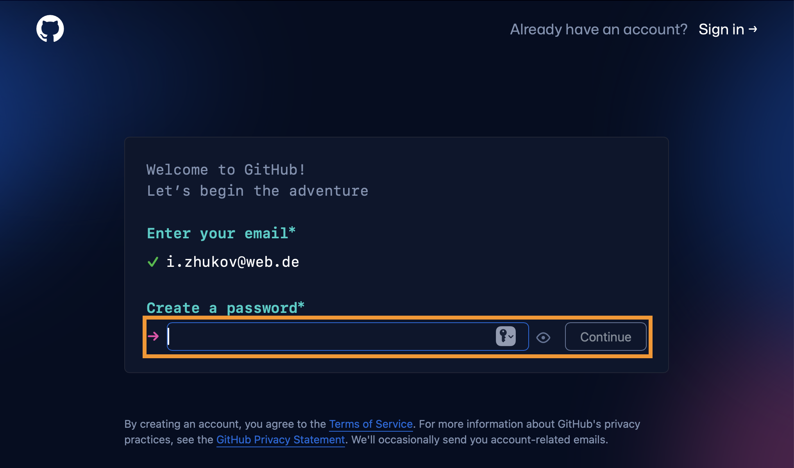
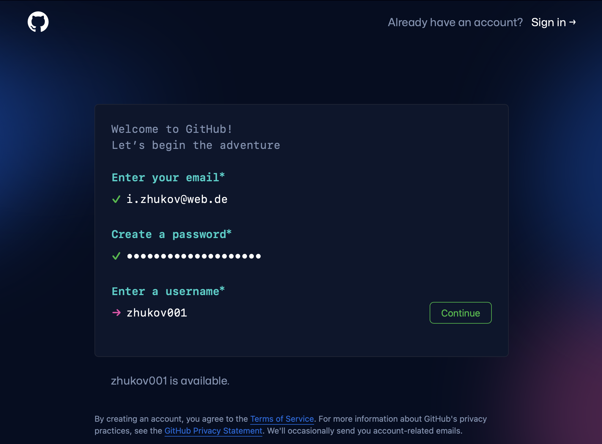
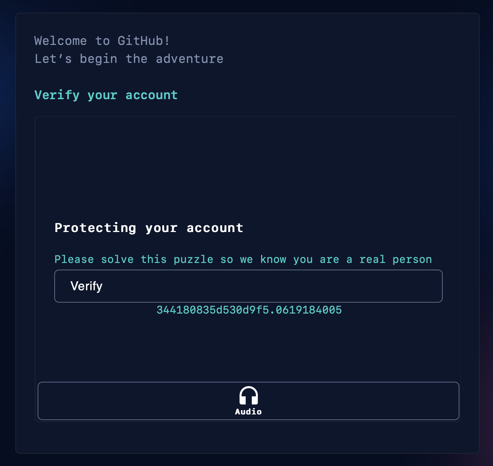
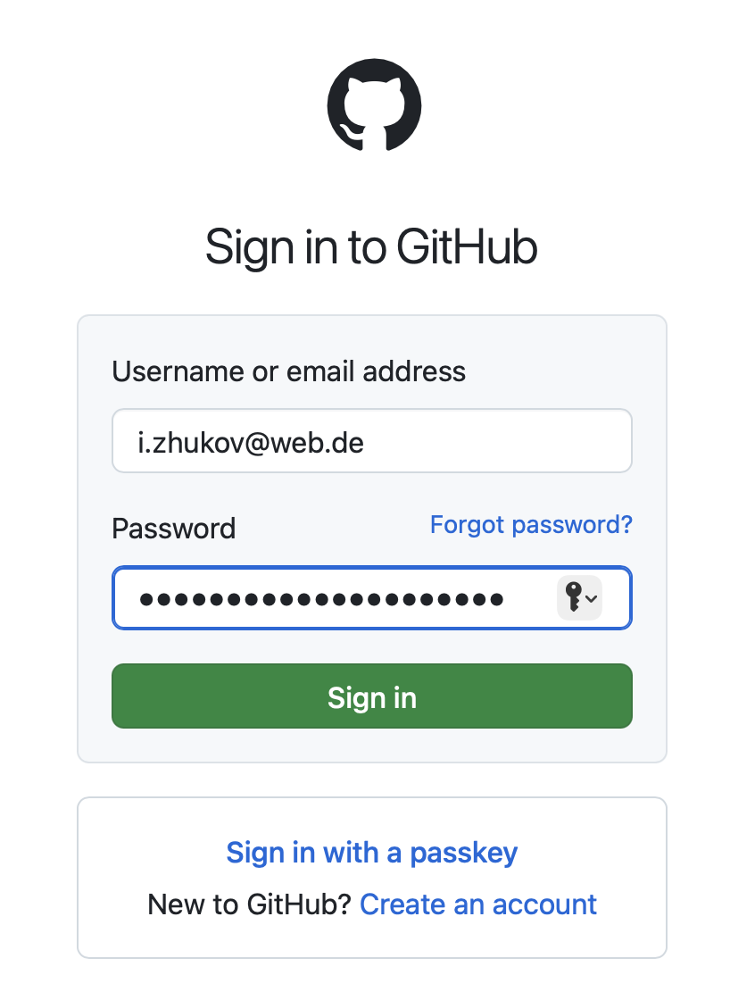
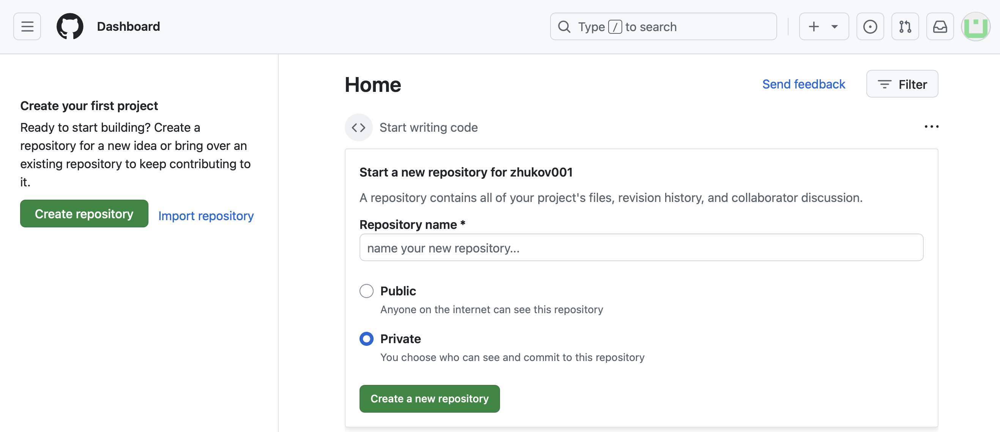

# How to create GitHub account

:::tip

We will use GitHub for this tutorial. If you already have an account, you can skip this step.

:::

:::info

GitHub is a web-based platform for version control and collaboration, built on top of Git. It allows developers to store, manage, and track changes to code, collaborate with others, and host projects publicly or privately. GitHub also provides features like pull requests, issues, and actions for continuous integration, making it a central hub for software development.

:::

Go to the github.com page and click on "Sign up"

Enter your email and click on "Continue"

Select strong password

Select username

Verify that you are not a robot

Confirm your e-mail address by providing a launch code

Congratulations! Your GitHub account was created. Sign in with your email and password

Here is how your entry page should look like

